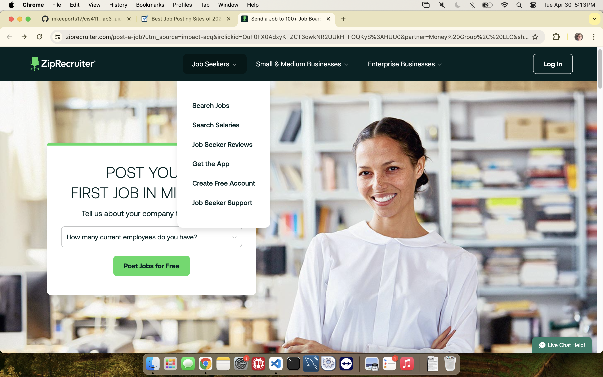
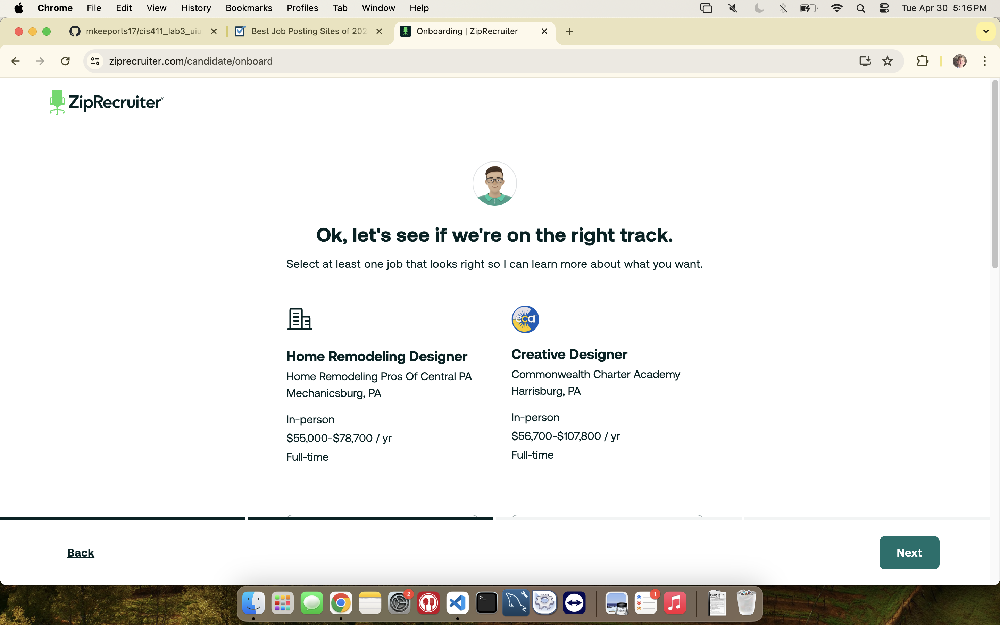
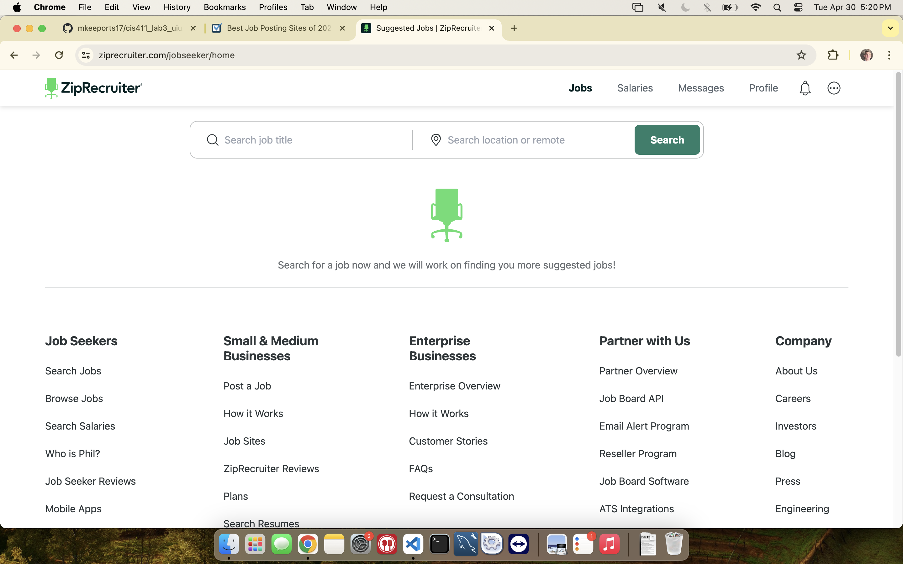
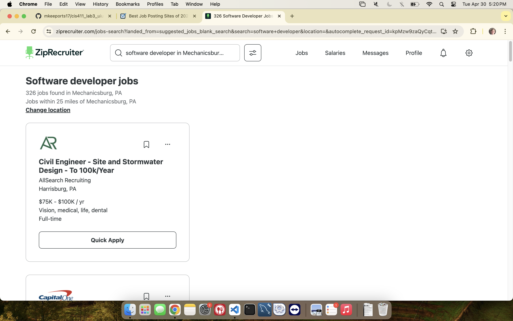
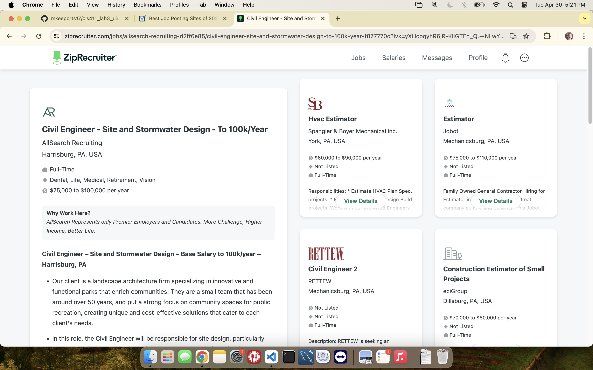
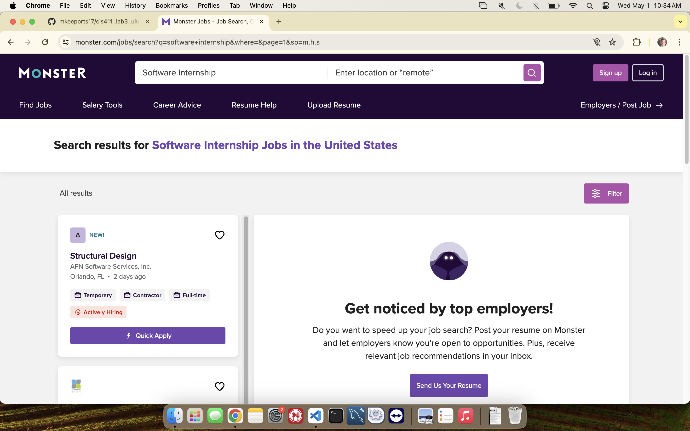
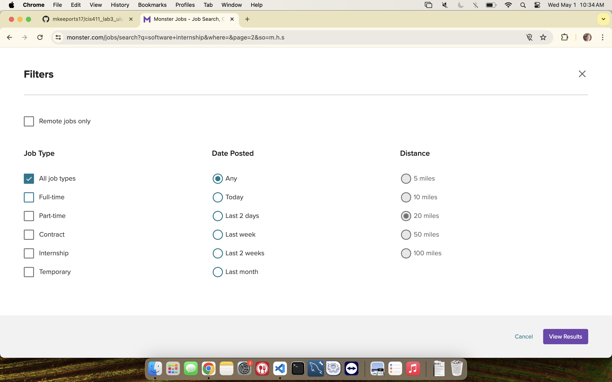
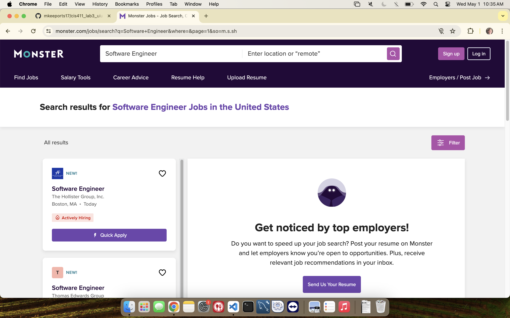
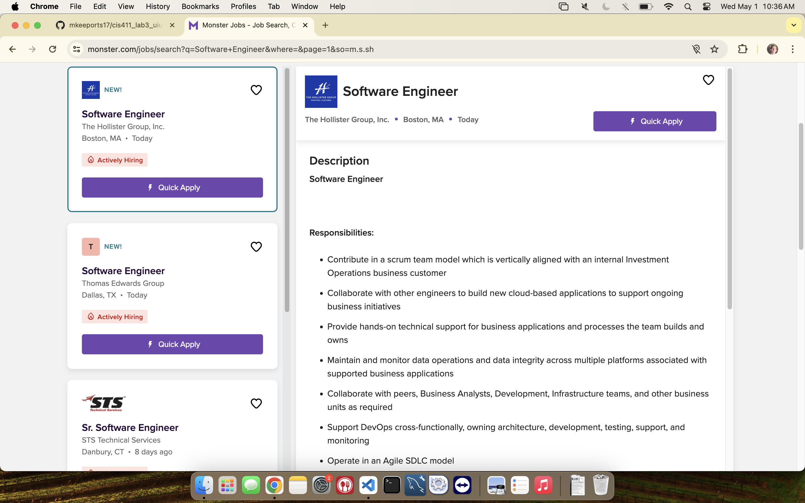

# Lab Report: UX/UI
___
**Course:** CIS 411, Spring 2024  
**Instructor(s):** [Devi Bhakta Suberi](https://github.com/dsuberi)  
**Name:** Michael Keeports  
**GitHub Handle:** @mkeeports17  
**Repository:** https://github.com/mkeeports17/cis411_lab3_uiux  
**Collaborators:**  
___

# Step 1: Confirm Lab Setup
- [X] I have forked the repository and created my lab report
- [X] If I'm collaborating on this project, I have included their handles on the report and confirm that my report is informed, but not copied from my collaborators.

# Step 2: Evaluate Online Job Search Sites

## 2.1 Summary
| Site | Score | Summary |
|---|---|---|
| ZipRecruiter | 52% | ZipRecruiter was a decent job search site but I will not be using it. I definitely think it needs work on both UI and UX. The main issue is that after entering my data multiple times it couldn't even find any jobs for what I wanted. |
| Monster | 71% | Monster was a pretty good site, I probably still won't use it over indeed or LinkedIn though. I liked how you get right into the action without making an account or a resume to be able to search. Decent UI but a few hiccups. |

## 2.2 Site 1: ZipRecruiter
The following screenshots are from my journey on ZipRecruiter

 This site was nice at first because, unlike other sites it had a big tab labeled 'job seekers' which is what I was looking for. Some sites were mainly made for employers and were hard to navigate. Here is where I found the tab that says 'search jobs.'  

 Once I put in some information, including the job title I wanted (Software Developer), ZipRecruiter returns some jobs that are supposed to be what I'm looking for but this is discouraging as none of these jobs are anything like a software job. I even tried to update my search fields which it prompted me to do, but I had no luck. I could not get any software jobs. Very discouraging. So I just clicked skip.  

 The software is pretty nice on this site but once I ended up entering my resume and completing my profile by entering even more data, it takes me to this search page where I am prompted to enter a search field. This is kind of discouraging because I already took the time to enter search fields last time so I wish it had saved that data. But at least it was really easy to use and a good interface for entering the data again.  

 As you can see, I searched software developer and I didn't really get many results of software jobs. Whether this is the fault of the search algorithm or if people just don't use this site, it's still a waste of my time to see civil engineering job openings. Furthermore, in this full screenshot you can only see one job offering as most of the screen is blank which is unacceptable. This looks stupid and wastes a lot of my time making me continue to scroll. The box with the data is nice though, if there were more on the screen.  

 When I click on the top job opprtunity to see more information, it hardly even opens up cuz it only takes up a little bit more space on the screen than it already did. Much of the screen is taken up by other job opportunities to explore but I do not like this. If i'm going to click on the job for more details then I'm gonna want it to take up the full screen and have the browse opprtunities eitehr at the bottom or on a much narrower tab on the side.   

   

| Category | Grade (0-3) | Comments / Justification |
|---|---|---|
| 1. **Don't make me think:** How intuitive was this site? |  2  | This site was pretty intuitive, I didn't really need to think very hard. It told me what to do. |
| 2. **Users are busy:** Did this site value your time?  | 3 | This site did value my time because it took only a few minutes to set up. |
| 3. **Good billboard design:** Did this site make the important steps and information clear? How or how not? | 1 | Not really. Displaying the job positings after the search does a really bad job of making information clear. It also didn't do that great of a job helping me build the important parts of my profile. |
| 4. **Tell me what to do:** Did this site lead you towards a specific, opinionated path? | 3 | Yes, it told me what to do at first. By giving me only one option I couldn't have really gotten lost or confused. |
| 5. **Omit Words:** How careful was this site with its use of copy? | 1 | Not very careful. Asked me to enter data multiple times. Also displayed many of the same messages repeatedly. |
| 6. **Navigation:** How effective was the workflow / navigation of the site? | 1 | It made me enter data at first and it could not find a related position. Then later when it let me into the main search I found a few software positions. |
| 7. **Accessibility:** How accessible is this site to a screen reader or a mouse-less interface? | 1 | It would be challenging to be able to use their searching functions without a mouse. |
| **TOTAL** | 11/21 | 52% |

## 2.3 Site 2: Monster
The following screenshots are from my journey on Monster

 The nice thing about Monster is that you do not need to log in or create an account. Although you should for optimal use, Monster doesn't force you to make an account to be able to search their site, giving you a headstart on finding a job. This is also useful because you can just look for reference to see what jobs are available, and you can take the time to sign in or create an account once you actually find a job you want to apply for. 

 When I searched this database it actually returned fully software jobs, unlike zipRecruiter, and there was even an internship select box in the filter tab as you can see in this picture. This filter tab is convenient. 

 
When I hit filter here is the results page. It's nice, the UI is pretty good but I do not like how much of my screen is taken up by the navbar and other stuff at the top. I wish I didn't need to scroll down to be able to see a second job. Furthermore, the details tab on the right starts by telling me to add my resume. I wish it would automatically apply to the top result so I didn't need to make an extra click on that.
 

 Once I initially scroll down to get the navbar away I can see more results so this screenshot looks better. I like the way this page is setup, with a decent UI showing me all of the other jobs while giving me plenty of room to see the job I'm currently checking out. 

| Category | Grade (0-3) | Comments / Justification |
|---|---|---|
| 1. **Don't make me think:** How intuitive was this site? | 3 | This site was very intuitive, all I did was search my search terms. |
| 2. **Users are busy:** Did this site value your time?  | 3 | This site valued my time well by allowing me to jump right into the search function. |
| 3. **Good billboard design:** Did this site make the important steps and information clear? How or how not? | 2 | This site kept it simple so I could jump right in but it didn't encourage me to add my resume and other important steps. |
| 4. **Tell me what to do:** Did this site lead you towards a specific, opinionated path? | 2 | Kept it simple and didn't have me do some waste of time steps. |
| 5. **Omit Words:** How careful was this site with its use of copy? | 2 | I don't think this site was too redundant with it's words. |
| 6. **Navigation:** How effective was the workflow / navigation of the site? | 2 | Pretty good, except there wasn't really much navigation, it didn't hreally have many functions other than the main search. |
| 7. **Accessibility:** How accessible is this site to a screen reader or a mouse-less interface? | 1 | This site was actually really annoying with accessibility- for example, I often hit enter when done typying to search, but this site did not allow that. It made me waste my time to go click the search button. So this site would not be easy without a mouse. |
| **TOTAL** | 15/21 | 71% |

# Step 3 Competitive Usability Test

## Step 3.1 Product Use Case

| Use Case #1 |  |
|---|---|
| Title | View 8 semester plan |
| Description / Steps | Student views the planned courses they should take for the next 8 semesters, based on their major/concentration. |
| Primary Actor | Student in CIS at Messiah. |
| Preconditions | Student is registered in CIS and is on the page. |
| Postconditions | Student prints their new plan and gives to their advisor. |

## Step 3.2 Identify a competitive product

List of Competitors
1. Competitor 1 [Degreeworks](https://degreeworks-c.messiah.edu:8441/worksheets/WEB31)
2. Competitor 2 [The View](https://ssb8c.messiah.edu/ssb8/mc_schdlist.P_Schedule_List_Init?TERM_IN=200810)
3. Competitor 3 [Ellucian](https://ssb-regc.messiah.edu/StudentRegistrationSsb/ssb/registration)
4. Comptitor 4 [8 Sem Plan Messiah](https://www.messiah.edu/download/downloads/id/6041/2018_Advising_handbook_III_CIS.pdf)

## Step 3.3 Write a Usability Test

| Step | Tasks | Notes |
|---|---|---|
| 1 | View 8 semester plan for their major |   |
| 2 | Process a what-if calculation for if they chose a different major. |   |
| 3 | View the prerequisites for the classes they need. |   |
| 4 | Find when the courses they need are offered. |   |

## Step 3.4 Observe User Interactions

| Step | Tasks | Observations |
|---|---|---|
| 1 | View 8 semester plan for their concentration | The user was able to figure out where to enter their concentration and view their 8 semester planner. They were happy with this convenient tool. |
| 2 | Process a what-if calculation for if they chose a different major.  | User found it very easy to switch concentrations to a different one that they are considering and view the 8 semester plan for that concentration. |
| 3 | View the prerequisites for the classes they need.  | Student had to look for it but was able to find the data for each course that said it's prerequisites. |
| 4 | Find when the courses they need are offered.  | After finding the prereqs the student knew exactly where to find the course offering information for each course. |

## Step 3.5 Findings

I think 3 improvements for my workflow could be:
- Change the color scheme to make it look more like messiah colors
- Make a page that shows the class prerequisites and offering so that they don't need to click on each class individually to find this
- Providing suggested advisors email adresses

2 improvements that were beneficial to the user:
- Very easy drop down select box for switching to view other concentrations's courses
- Easy to use print out schedule button at the bottom of the page

What do you believe your team did well in conducting the usability test?
- Combining all the necessary information they need to schedule their core major classes
- No need for the user to login so the user can jump right into the action

What could your team improve for next time?
- Add details on the staff in the department. Include their email addresses, office locations, and office hours.

Offer a brief statement about your experience conducting a usability test.
- I thought this experience was definitely challenging. Explaining to the user the actions they should be taking without actually telling them what to do was a difficult task. I think next time we should maybe make the usability test a little bit more in depth.